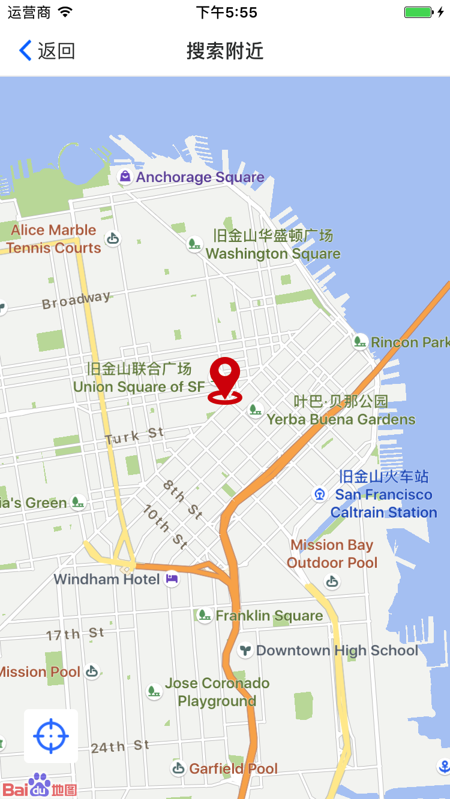
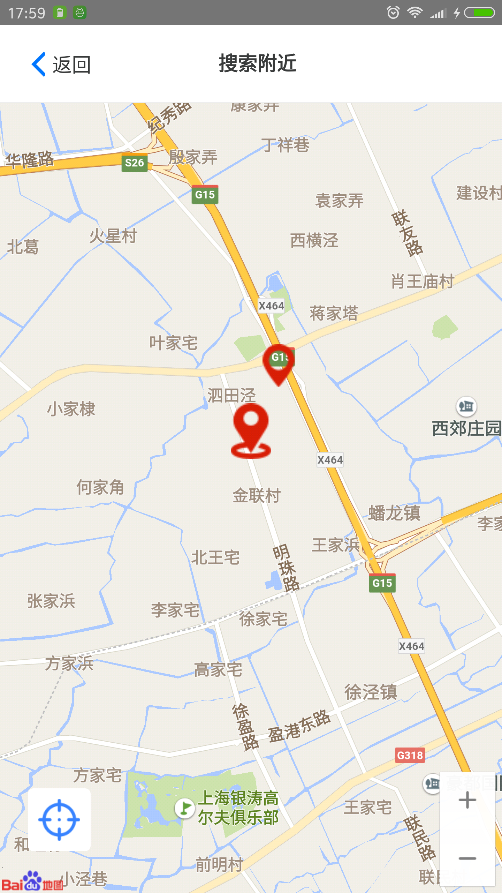
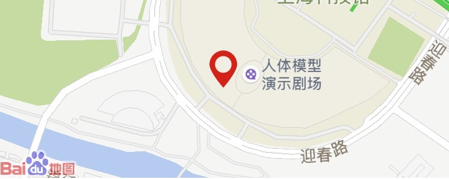

# react-native-baidu-map-wabg

 基于[【react-native-baidu-map】](https://github.com/lovebing/react-native-baidu-map)添加了一些自定义属性或方法,这里主要说下我修改的东西，详情参考原文

       

  

* IOS和Android修改的东西基本一样，本示例只做参考，请根据代码自行调整

- Geolocation中添加了`detailSearch` `suggestSearch` `nearbySearch` 方法

## detailSearch 详情搜索

-  `<uid>` 百度地图返回的uid

```js
detailSearch(uid){
    return new Promise((resolve, reject) => {
      try {
        _module.detailSearch(uid);
      }
      catch (e) {
        reject(e);
      }
      DeviceEventEmitter.once('onGetDetailSearchResult', resp => {
        resolve(resp);
      });
    });
  }
```

## suggestSearch 建议搜索

- `<keyword>` 搜索关键字
- `<cityname>` 搜索城市名称

```js
suggestSearch(keyword, cityname){
    if (Platform.OS == 'ios') {
      return new Promise((resolve, reject) => {
        try {
          _module.suggestSearch(keyword,cityname);
        }
        catch (e) {
          reject(e);
          return;
        }
        NativeAppEventEmitter.once('onGetSuggestionResult',(resp) => {
          resolve(resp)
        })
      },(error) => {
        reject(error);
      });
    }
    return new Promise((resolve, reject) => {
      try {
        _module.suggestSearch(keyword, cityname);
      }
      catch (e) {
        reject(e);
      }
      DeviceEventEmitter.once('OnGetSuggestionResult', resp => {
        resolve(resp);
      });
    });
  }
```

JS示例：

```js
Geolocation.suggestSearch(keyword,city)
.then(res => {
  if(res&&res.code === 0){
    this.setState({list:res.data})
  }else{
    res.message && Alert.alert(res.message);
  }
})
.catch(e =>{
    
})
```

## nearbySearch 周边搜索

- `<lat>` 纬度
- `<lng>` 经度
- `<ak>` 服务端AK
- `<geoTableId>` lbs云表id
- `<filter>` 过滤字段

```js
nearbySearch(lat, lng, ak, geoTableId, filter){
    if (Platform.OS == 'ios') {
      return new Promise((resolve, reject) => {
        try {
          _module.nearbySearch(lat + '', lng  + '', ak, geoTableId, filter);
        }
        catch (e) {
          reject(e);
          return;
        }
        NativeAppEventEmitter.once('onCloudSearch',(resp) => {
          resolve(resp)
        })
      },(error) => {
        reject(error);
      });
    }
    return new Promise((resolve, reject) => {
      try {
        _module.nearbySearch(lat, lng ,ak, geoTableId, filter);
      }
      catch (e) {
        reject(e);
        return;
      }
      DeviceEventEmitter.once('onCloudSearchResult', resp => {
        resolve(resp);
      });
    });
  }
```

JS调用示例：

```js
Geolocation.nearbySearch(latitude ,longitude,Your_Server_AK, Your_GeoTableId,0)
.then(res => {
  console.log('nearbySearchMarkers',res);
  if(res&&res.code === 0){
    this.setState({
      markers:res.data || []
    })
  }else{
    console.log(res.message)
  }
})
.catch(e =>{
  console.warn(e, 'error');
})
```